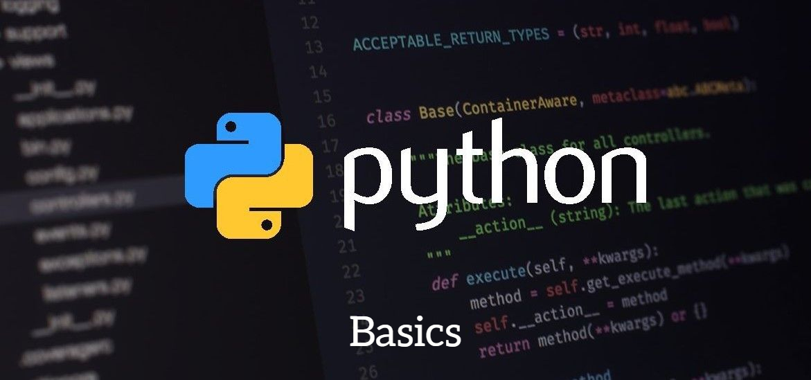

# Learn-Python-Basics
Python is a popular programming language in the world. Also, python is the major code language for <b>Artificial Intelligence</b> and <b>Machine Learning</b>. This repository includes python basics with theory and examples.

